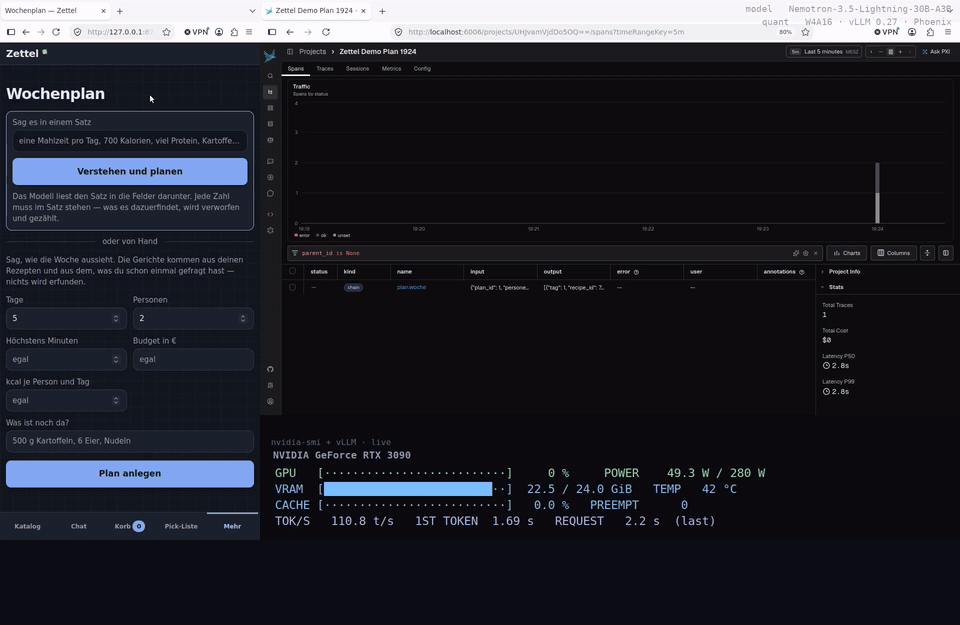
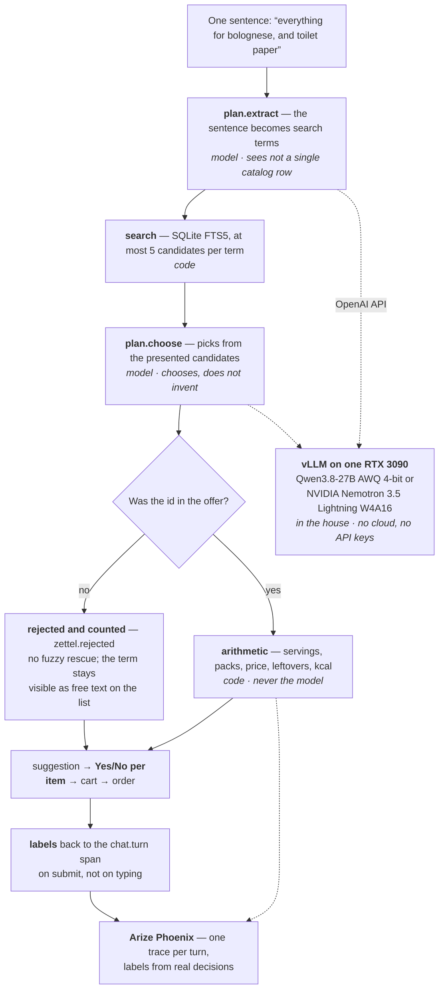

# Zettel

[](https://github.com/edrethardo/zettel/actions/workflows/tests.yml)   

**English edition** · Deutsch: [`README.md`](README.md)

*Zettel* (German for the slip of paper you take to the shop) is a grocery
agent for a multi-person household. Its furthest step: **a week of dinners
in, one shopping list out — minus what is already in the fridge.** One
sentence, and the model assigns dishes to days; it may only use dishes the
household already has, and it returns one sentence per day and not a single
number. Servings, weekly sums, stock, packs, price, kcal and protein are
computed in code.

The rule underneath is the same everywhere: the model is allowed to do
exactly one thing — **choose from what was retrieved** — never invent. An
invented id is rejected and counted; every Yes/No the household taps becomes
an eval label; every turn is one trace in Arize Phoenix. No cloud, no API
keys: one open model on one NVIDIA RTX 3090.



## In sixty seconds

* **Open model, one card, no cloud.** NVIDIA Nemotron 3.5 Lightning
  30B-A3B (W4A16) served by vLLM 0.27.1 on a single RTX 3090 in a living
  room. Every turn is one trace in Arize Phoenix; the GPU strip in the film
  shows KV cache, tokens per second and time to first token live.
* **Three rules, everywhere.** The model may only *choose* from what code
  retrieved; an invented id is rejected and counted, never repaired; every
  Yes or No a person taps goes back to the span as an eval label.
* **The furthest step: a week from one sentence.** "one meal a day, 700
  kcal, high protein, potatoes, eggs and pasta are in" — the model reads it
  into the fields (every number must be *in* the sentence), assigns dishes
  to days, and a No on one day re-plans that day only. Measured on the real
  database: five scenarios, **0 rejected** ([`EVALS.md`](EVALS.md)) — after a
  trace showed the one bug that was in the offer, not in the model.
* **Try it in five minutes without a GPU:** [`GETTING-STARTED.md`](GETTING-STARTED.md).
  The two-minute film is linked from the contest post; how it was made, take
  by take, is in [`docs/contest/VIDEO.md`](docs/contest/VIDEO.md).

| 128 German dishes, one RTX 3090 (2026-09-05) | ingredients found in the catalog | per dish | seconds per dish |
|---|---|---|---|
| **NVIDIA Nemotron 3.5 Lightning 30B-A3B** (W4A16) | 85 % | 87 % / 89 % | **6** |
| Qwen3.8-27B-Instruct (AWQ 4-bit), the reference | **87 %** | 89 % / 91 % | 20 |
| Llama-3.1-Nemotron-Nano-8B (64 dishes, 2026-08-30) | 11 % | 25 % / 0 % | 21 |

**The tour: [`SHOWCASE.md`](SHOWCASE.md) · the copyable pattern: [`PATTERN.md`](PATTERN.md) · run it: [`GETTING-STARTED.md`](GETTING-STARTED.md) · the numbers: [`EVALS.md`](EVALS.md) · two debugging stories: [`CASE-STUDY.md`](CASE-STUDY.md) · contribute: [`CONTRIBUTING.md`](CONTRIBUTING.md).**

## The week planner: a week in, one list out


The furthest step, and the most interesting one. Under **More → Week plan**
you type one sentence — or four numbers (days, people, minutes at the stove,
budget) and what is still in the fridge ("500 g potatoes, 6 eggs, pasta").
Then the model fills the days.

* **It chooses only from what the household already has** — its own recipes
  and dishes that were fetched in the chat before. A dish id that was not
  presented is rejected and counted, never repaired. Since 2026-09-10 the
  offer holds only what can be chosen, and the JSON schema enumerates the
  allowed ids and the open days, so guided decoding cannot produce anything
  else; the check in code stays.
* **It returns one sentence per day and not a single number.** Servings,
  sums across the week, stock deducted, packs, price, leftovers, kcal and
  protein per day are computed in code.
* **Stock is not an inventory.** It holds for *this* plan. The shop knows
  purchases, not consumption — a maintained pantry would be silently wrong
  after a few days. So yesterday's receipt may suggest ("10 eggs — still
  there?"), but nothing counts before a Yes.
* **A No on one day re-plans that day only.** The rest stays, and the
  rejected dish does not come back.
* **One sentence instead of the numbers.** "one meal a day, 700 kcal, high
  protein, potatoes, eggs and pasta are in" — the model reads it into the
  fields. Every number it returns must be *in* the sentence, every stock
  item a piece of the sentence; what is not is rejected and counted
  (`zettel.rahmen.rejected`). The model may read, not know.

## What it stands on


A private ordering shop for a multi-person household on a tailnet. One person puts groceries into a cart and submits the order, a second
buys them physically at the store and ticks them off there on a phone. **No order is ever sent to a real
retailer.** Plus a chat field: free text ("everything for spaghetti
bolognese, and toilet paper") is mapped to real catalog products and
presented as a suggestion — the turn where the rule was born, and where it
was measured across 128 dishes and three models (table above).

Second, equal purpose: the agent is fully observable, evaluable and
reproducibly comparable in Arize Phoenix.

## How it is built

Four model stages, and none of them may invent anything. The chat turn is
drawn because it is the smallest complete execution of the rule — the week
plan (`plan.woche`) has the same shape one level up: dishes from the
household's own stock instead of products from the catalog, and servings,
stock and kcal computed on top of packs and price. In italics: **who** does
the step — that is the whole idea.



Three things the sketch should make readable:

1. **Stage 1 never sees the catalog.** It turns a sentence into search terms,
   nothing more — so it cannot invent a product that would be there to
   invent. The search is FTS5, not the model.
2. **The check lives in code, not in the schema.** A JSON schema enforces the
   *shape*, not the *truth*. After a vLLM upgrade, guided decoding was
   silently unenforced for four days and not a single number moved — because
   the check never hung there ([`CASE-STUDY.md`](CASE-STUDY.md)).
3. **Nobody annotates.** The Yes/No the household types anyway *is* the eval
   label. It goes to the span on submit, not on typing.

The three code locations to copy are in [`PATTERN.md`](PATTERN.md); the
architecture decisions, including the ones that look like accidents from
outside, are in [`DESIGN.md`](DESIGN.md) (German).

## Measured: 0 invented dishes

The week planner against the **real database** (a copy: 16,746 products,
57 recipes), five scenarios, six turns (scenario D re-plans once after a
No). Qwen3.8-27B-Instruct, AWQ 4-bit, on one RTX 3090, 2026-09-06:

| Turn | dishes offered | days assigned | invented → rejected | time |
|---|---|---|---|---|
| A — 3 days, ≤ 40 min, stock declared | 3 | 3 of 3 | **0** | 7.3 s |
| B — 5 days, 4 people, budget 60 € | 19 | 5 of 5 | **0** | 12.2 s |
| C — 3 days, day 2 out | 19 | 3 of 3 | **0** | 5.3 s |
| D — as A | 3 | 3 of 3 | **0** | 7.3 s |
| D' — after a No on day 1, re-plan | 2 | 0 of 1 | **0** | 0.5 s |
| E — 7 days, ≤ 30 min | 1 | 1 of 7 | **0** | 3.6 s |

"Invented" and "rejected" are the same column, and that is the point: a
dish id that was not offered is not repaired but rejected and counted. The
check had nothing to do in these six turns — it stands anyway, because you
only know it had nothing to do because it counts.

**The same run on Nemotron 3.5 Lightning** (2026-09-10, W4A16, 32k context,
five scenarios in 21 s): 0 invented dishes in the four normal scenarios. In
the two thin ones — one dish for seven days, a re-plan where the remaining
dishes were already fixed on other days — **the code rejected 6 and 3
proposals**: the same dish on every day, fixed days filled again. None
reached the page. The finding behind it was a bug in the offer, not in the
model: dishes already in the plan were offered again. Fixed the same
afternoon — the offer holds only what can be chosen, the schema enumerates
ids and days — and re-measured: **0 rejected in all five scenarios, 20 s.**
All three runs with tables in [`EVALS.md`](EVALS.md); raw data and
provenance (stack, endpoint, model, context length, KV cache, commit,
Phoenix project) sit next to them in `evals/`.


On the left, the whole machinery of one turn as a tree; on the right what
was counted: `zettel.plan.presented`, `assigned`, **`rejected = 0`**, plus
`covered`, `rest`, `lines`, `price_cents` — the numbers of the shopping
list, all computed in code. The *Info* tab shows the model's input and
output verbatim: in go frame, stock and open days; out come `tag`,
`recipe_id`, `name` and one sentence of `grund` — and nothing else. The
annotation `plan_day: kept` on the span is not a manual note but the Yes
somebody tapped on the page.

## What the observability is for — one case

To "…and I still need toothpaste and butter" the model picked a
**ButterBoyz artisanal salted butter for 4.69 €**. A miss. The obvious
explanation is a bad model; the trace says that explanation is wrong:

```
"Butter" — 5 candidates offered        zettel.rejected = 0
   4.01  #1771  ButterBoyz BIO Butter Chili & Röstzwiebel
   4.01  #1772  ButterBoyz BIO Butter Feige & Anis
   3.96  #1757  ButterBoyz BIO Kräuterbutter
   3.96  #1766  ButterBoyz BIO Salzbutter      ← chosen
   3.96  #1768  ButterBoyz BIO Steinpilzbutter
"Zahnpasta" — 0 candidates offered
```

`rejected = 0` means the model invented nothing, it chose from the list —
and there was no plain butter on the list. **The miss belongs to retrieval,
not to the model.** That is exactly why `catalog.search` is a `RETRIEVER`
span and not a `TOOL`. The whole contract is in
[`OBSERVABILITY.md`](OBSERVABILITY.md) (German; the attribute names are
self-explanatory).

## Run it

```bash
git clone https://github.com/edrethardo/zettel && cd zettel
python3 -m venv .venv && .venv/bin/pip install -r requirements.txt
.venv/bin/python -m zettel.scrapers.nachtlauf --begriff milch   # a slice of catalog
.venv/bin/python -m zettel.web.app                              # http://127.0.0.1:8730
```

Catalog, cart, pick list and saved recipes run without a model. For the chat
and the planner you need an OpenAI-compatible endpoint — the exact
`vllm serve` line for Nemotron 3.5 Lightning on one RTX 3090 (vLLM 0.27.1,
32k context, fp8 KV cache) is in
[`GETTING-STARTED.md`](GETTING-STARTED.md#serve-the-model-on-one-rtx-3090);
for traces, `pip install arize-phoenix && phoenix serve`.

```bash
.venv/bin/python -m pytest -q             # 1,517 tests (14 skipped), ~95 s, no network
.venv/bin/python checks/smoke.py          # 79 checks; the network is blocked at socket level
```

## Using this outside Germany

The interface speaks German and English — switch it under *More →
Language*; screen text lives in `zettel/web/texte/*.json`, and a partial
translation is welcome because anything missing falls back to German. The
catalog source is one German shop, and everything above it does not care
where products came from: `product` carries a `source` column. Adding your
own supermarket is one crawler and one parser; the method is written down in
[`.claude/skills/grocery-catalog-source/`](.claude/skills/grocery-catalog-source/SKILL.md).
The code itself stays German — [`CONTRIBUTING.md`](CONTRIBUTING.md) explains
why, and why that does not have to stop you.

## The documents

| File | What it is about |
|---|---|
| [`SHOWCASE.md`](SHOWCASE.md) | English: the product tour with screenshots, the guarantees, the numbers |
| [`PATTERN.md`](PATTERN.md) | English: the transferable pattern — choose from what was found, reject and count what was invented, decisions as labels — with the three code locations |
| [`GETTING-STARTED.md`](GETTING-STARTED.md) | English: install, configure, the first turn, verify, measure a model |
| [`CASE-STUDY.md`](CASE-STUDY.md) | English: two debugging stories — one trace acquitted the model, one measured line took the eval from 76 % to 83 % |
| [`EVALS.md`](EVALS.md) | German: dataset, evaluators, the variants and the real numbers — tables are readable without the prose |
| [`DESIGN.md`](DESIGN.md), [`OBSERVABILITY.md`](OBSERVABILITY.md), [`GATES.md`](GATES.md) | German: architecture, the span contract, what the gates cover |
| [`ANLEITUNG.md`](ANLEITUNG.md) | German: the household manual |
| [`docs/contest/`](docs/contest/) | the contest post and the making of the film |

Submitted to the NVIDIA GTC Berlin Golden Ticket Contest 2026 · `#NVIDIAGTC`.
MIT license.
