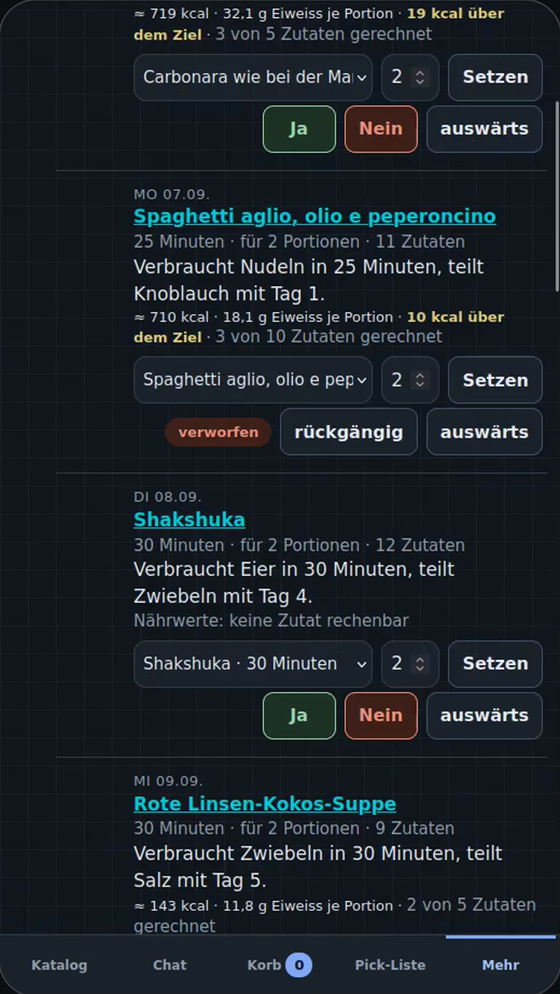
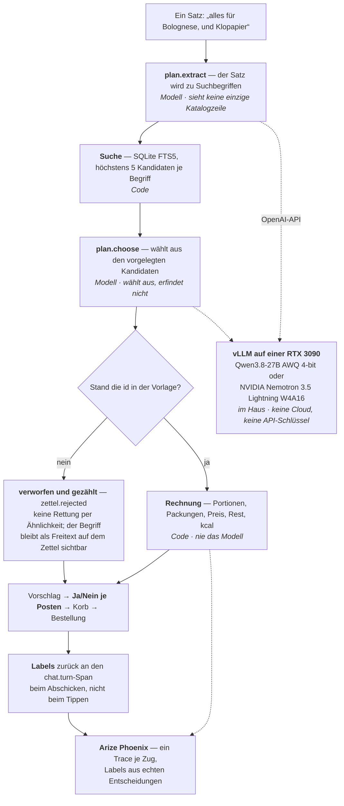
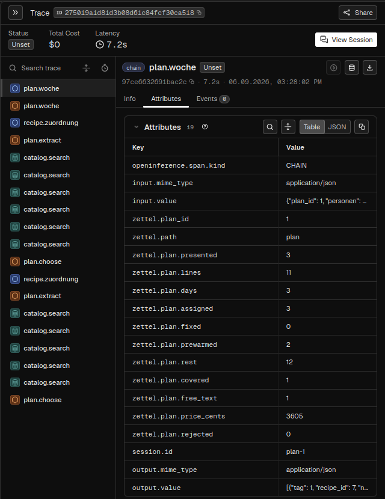

# Zettel

> **English** — Zettel (German for the slip of paper you take to the shop) is
> a grocery agent for a multi-person household. Its furthest step: **a week of
> dinners in, one shopping list out — minus what is already in the fridge.**
> Four numbers and one sentence, and the model assigns dishes to days; it may
> only use dishes the household already has, and it returns one sentence per
> day and not a single number. Servings, weekly sums, stock, packs, price,
> kcal and protein are computed in code.
>
> The rule underneath is the same everywhere: the model is allowed to do
> exactly one thing — **choose from what was retrieved** — never invent. An
> invented id is rejected and counted; every Yes/No the household taps becomes
> an eval label; every turn is one trace in Arize Phoenix. No cloud, no API
> keys: one open model on one NVIDIA RTX 3090.



| 128 German dishes, one RTX 3090 (2026-09-05) | ingredients found in the catalog | per dish | seconds per dish |
|---|---|---|---|
| **NVIDIA Nemotron 3.5 Lightning 30B-A3B** (W4A16) | 85 % | 87 % / 89 % | **6** |
| Qwen3.8-27B-Instruct (AWQ 4-bit), the reference | **87 %** | 89 % / 91 % | 20 |
| Llama-3.1-Nemotron-Nano-8B (64 dishes, 2026-08-30) | 11 % | 25 % / 0 % | 21 |

**English tour: [`SHOWCASE.md`](SHOWCASE.md) · the copyable pattern: [`PATTERN.md`](PATTERN.md) · run it: [`GETTING-STARTED.md`](GETTING-STARTED.md) · the numbers: [`EVALS.md`](EVALS.md) · two debugging stories: [`CASE-STUDY.md`](CASE-STUDY.md) · contribute: [`CONTRIBUTING.md`](CONTRIBUTING.md).** The rest of this README is in German, the household's language.

> **Using this outside Germany.** The interface speaks German and English —
> switch it under *More → Language*; screen text lives in
> `zettel/web/texte/*.json` and a partial translation is welcome, because
> anything missing falls back to German. The catalogue source is one German
> shop, and everything above it does not care where products came from:
> `product` carries a `source` column. Adding your own supermarket is one
> crawler and one parser, and the method — how to check `robots.txt` first,
> how to find the endpoint the shop's own front-end uses, and the five guards
> that keep a bad night from erasing your catalogue — is written down in
> [`.claude/skills/grocery-catalog-source/`](.claude/skills/grocery-catalog-source/SKILL.md).
> The code itself stays German; `CONTRIBUTING.md` explains why, and why that
> does not have to stop you.

## Der Wochenplan: eine Woche rein, eine Liste raus

Die weiteste Stufe, und die interessanteste. Unter **Mehr → Wochenplan**
stehen vier Zahlen — Tage, Personen, höchstens Minuten am Herd, Budget — und
ein Satz: was noch da ist („500 g Kartoffeln, 6 Eier, Nudeln"). Dann belegt
das Modell die Tage.

* **Es wählt nur aus, was der Haushalt schon hat** — eigene Rezepte und
  Gerichte, die im Chat schon einmal geholt wurden. Eine Gericht-id, die nicht
  vorgelegt wurde, wird verworfen und gezählt, nie repariert.
* **Es liefert einen Satz je Tag und keine einzige Zahl.** Portionen, Summen
  über die Woche, Bestand abziehen, Packungen, Preis, Rest, kcal und Eiweiss
  je Tag rechnet der Code.
* **Der Bestand ist kein Lagerstand.** Er gilt für *diesen* Plan. Der Shop
  kennt Käufe, nicht Verbrauch — ein gepflegter Vorrat wäre nach ein paar
  Tagen still falsch. Der Bon von gestern darf deshalb vorschlagen („10 Eier
  — noch da?"), aber nichts zählt vor einem Ja.
* **„Nein" an einem Tag plant nur diesen Tag neu.** Der Rest bleibt stehen,
  und das abgelehnte Gericht kommt nicht wieder.

Messung weiter unten und in [`EVALS.md`](EVALS.md).

## Worauf er steht


Ein privater Bestell-Shop für einen Mehrpersonenhaushalt im Tailnet. Eine Person legt Lebensmittel in einen Warenkorb und schickt die
Bestellung ab, eine zweite kauft sie physisch im Laden ein und hakt sie
dort auf dem Handy ab. **Es wird nie eine
Bestellung an einen echten Händler geschickt.** Dazu ein Chat-Feld: freier Text
(„alles für Spaghetti Bolognese, und Klopapier") wird auf echte
Katalogprodukte abgebildet und als Vorschlag vorgelegt — der Zug, an dem die
Regel entstanden ist und an dem sie über 128 Gerichte und drei Modelle
gemessen wurde (Tabelle oben).

Zweiter, gleichrangiger Zweck: Der Agent ist in Arize Phoenix vollständig
beobachtbar, bewertbar und reproduzierbar vergleichbar.

## Demo

Zwei Filme, beide ohne Ton und mit eingebrannten Untertiteln, beide auf
derselben Bühne gedreht (Xvfb, App in Handybreite links, Phoenix rechts):

| Film | Was er zeigt |
|---|---|
| **Der Wochenplan**, 86,9 s | Eine Woche wird eine Liste, abzüglich dessen, was schon da ist — kcal und Eiweiss je Tag daneben. Unten laufen die Zahlen des Modells mit: 144,8 t/s, erster Token nach 0,88 s, keine Verdrängung. Modell im Bild: Qwen3.8-27B-Instruct. |
| **Der Chat-Zug**, 90,9 s | Ein Satz wird eine Einkaufsliste, mit dem Trace daneben, live. Modell im Bild: NVIDIA Nemotron 3.5 Lightning. |

Der Link wird hier eingetragen, sobald der Film veröffentlicht ist — ein
Platzhalter, der ins Leere zeigt, wäre schlechter als keiner. Drehbuch,
Takes und Schnitt stehen vollständig in
[`docs/contest/VIDEO.md`](docs/contest/VIDEO.md), inklusive der vier Takes,
die unbrauchbar waren, und warum.

Eingereicht beim NVIDIA GTC Berlin Golden Ticket Contest 2026 · `#NVIDIAGTC`

## Wie es gebaut ist

Vier Modellstufen, und keine davon darf etwas erfinden. Gezeichnet ist der
Chat-Zug, weil er die kleinste vollständige Ausführung der Regel ist — der
Wochenplan (`plan.woche`) hat dieselbe Form eine Ebene höher: statt Produkten
aus dem Katalog werden Gerichte aus dem eigenen Bestand vorgelegt, und statt
Packungen und Preis werden zusätzlich Portionen, Bestand und kcal gerechnet.
Kursiv steht, **wer** den Schritt macht — das ist die ganze Idee:



Drei Dinge, die man an der Skizze ablesen können soll:

1. **Stufe 1 sieht den Katalog nicht.** Sie macht aus einem Satz Suchbegriffe,
   mehr nicht — deshalb kann sie kein Produkt erfinden, das es zu erfinden
   gäbe. Gesucht wird mit FTS5, nicht mit dem Modell.
2. **Die Prüfung steht im Code, nicht im Schema.** Ein JSON-Schema erzwingt
   die *Form*, nicht die *Wahrheit*. Nach einem vLLM-Upgrade war Guided
   Decoding vier Tage lang still wirkungslos, und keine Zahl bewegte sich —
   weil die Prüfung nie dort hing (`CASE-STUDY.md`).
3. **Niemand annotiert.** Das Ja/Nein, das der Haushalt ohnehin tippt, *ist*
   das Eval-Label. Es geht beim Abschicken an den Span, nicht beim Tippen.

Wer das Muster in eigenen Code holen will, findet die drei Codestellen in
[`PATTERN.md`](PATTERN.md); die Architekturentscheidungen samt der
Begründungen, die von aussen wie ein Versehen aussehen, stehen in
[`DESIGN.md`](DESIGN.md).

## Gemessen: 0 erfundene Gerichte in 6 Zügen

Der Wochenplaner am 2026-09-06 gegen die **echte Datenbank** (Kopie: 16.746
Produkte, 57 Rezepte, davon 19 in der Vorlage), fünf Szenarien, sechs Züge
(Szenario D plant nach einem „Nein" ein zweites Mal). Modell:
**Qwen3.8-27B-Instruct**, AWQ 4-bit, auf einer RTX 3090.

| Zug | Gerichte vorgelegt | Tagen zugewiesen | erfunden → verworfen | Dauer |
|---|---|---|---|---|
| A — 3 Tage, ≤ 40 min, Bestand erklärt | 3 | 3 von 3 | **0** | 7,3 s |
| B — 5 Tage, 4 Personen, Budget 60 € | 19 | 5 von 5 | **0** | 12,2 s |
| C — 3 Tage, Tag 2 auswärts | 19 | 3 von 3 | **0** | 5,3 s |
| D — wie A | 3 | 3 von 3 | **0** | 7,3 s |
| D' — nach „Nein" auf Tag 1, Neuplanung | 2 | 0 von 1 | **0** | 0,5 s |
| E — 7 Tage, ≤ 30 min | 1 | 1 von 7 | **0** | 3,6 s |

„Erfunden" und „verworfen" ist dieselbe Spalte, und das ist der Punkt: eine
Gericht-id, die nicht vorgelegt wurde, wird nicht repariert, sondern
verworfen und gezählt. Die Prüfung hatte in diesen sechs Zügen nichts zu
tun — sie steht trotzdem, denn dass sie nichts zu tun hat, weiss man nur,
weil sie zählt.

Zwei Zeilen, die man nicht überlesen sollte: **D' ist ehrlich leer** (nach dem
„Nein" standen die zwei übrigen Gerichte schon an anderen Tagen — das Modell
belegte nichts und bot das abgelehnte nicht wieder an), und **E zeigt die
Grenze der Vorlage, nicht des Modells** (unter 30 Minuten kennt die Datenbank
genau ein Gericht; sechs Tage bleiben leer, und die Seite sagt das). Die
Antwort auf „7 Tage, 30 Minuten" ist ein grösserer Rezeptbestand, kein
anderer Prompt.

Die Tabelle reproduzieren — die echte Datei fasst die Probe nie an:

```bash
sqlite3 data/picknick.db "VACUUM INTO 'kopie.db'"
ZETTEL_PHOENIX_PROJECT="Zettel Eval Wochenplan" \
.venv/bin/python scripts/plan_probe.py --db kopie.db --trace \
    --json evals/plan_probe-2026-09-06-qwen.json
```

So sieht einer dieser Züge in Arize Phoenix aus — Szenario A, 3 von 3 Tagen
belegt:



Links steht die ganze Maschinerie eines Zuges als Baum, rechts das, was
gezählt wurde: `zettel.plan.presented = 3` (so viele Gerichte lagen zur
Wahl), `assigned = 3` (so viele Tage wurden belegt), **`rejected = 0`** (kein
erfundenes Gericht), dazu `covered`, `rest`, `lines` und `price_cents` — die
Zahlen der Einkaufsliste, alle im Code gerechnet. Der Reiter *Info* daneben
zeigt Eingabe und Ausgabe des Modells im Wortlaut: hinein gehen Rahmen,
Bestand und die offenen Tage, heraus kommen `tag`, `recipe_id`, `name` und
ein Satz `grund` — und sonst nichts. Die Annotation `plan_day: kept` am Span
ist kein Nachtrag von Hand, sondern das „Ja", das jemand auf der Seite
getippt hat.

Rohdaten und Provenienz (Stack, Endpunkt, Modell, Kontextlänge, Commit,
Phoenix-Projekt) liegen als `evals/plan_probe-2026-09-06-qwen.*` daneben.
Die vollständige Tabelle mit Einkaufsliste, Bestand und Preis, und was diese
Messung ausdrücklich **nicht** sagt, steht in [`EVALS.md`](EVALS.md) unter
„Der Wochenplaner"; die 128-Gerichte-Messung des Chat-Zugs gegen drei Modelle
steht dort ebenfalls.

## Wozu die Observability gut ist — in einem Fall

Auf „…dazu brauche ich noch Zahnpasta und Butter" wählte das Modell eine
**ButterBoyz-Spezialbutter für 4,69 €**. Ein Fehlgriff. Die naheliegende
Erklärung ist ein schlechtes Modell; der Trace sagt, dass sie falsch ist:

```
„Butter“ — 5 Kandidaten vorgelegt        zettel.rejected = 0
   4,01  #1771  ButterBoyz BIO Butter Chili & Röstzwiebel
   4,01  #1772  ButterBoyz BIO Butter Feige & Anis
   3,96  #1757  ButterBoyz BIO Kräuterbutter
   3,96  #1766  ButterBoyz BIO Salzbutter      ← gewählt
   3,96  #1768  ButterBoyz BIO Steinpilzbutter
„Zahnpasta“ — 0 Kandidaten vorgelegt
```

`rejected = 0` heisst: das Modell hat nichts erfunden, es hat aus der Liste
gewählt — und in der Liste stand keine normale Butter. **Der Fehlgriff gehört
dem Retrieval, nicht dem Modell.** Genau deshalb ist `catalog.search` ein
`RETRIEVER`-Span und kein `TOOL`. Der ganze Vertrag steht in
[`OBSERVABILITY.md`](OBSERVABILITY.md).

## Die Dokumente

| Datei | worum es geht |
|---|---|
| [`PATTERN.md`](PATTERN.md) | Englisch: das übertragbare Muster — nur aus Gefundenem wählen, Erfundenes verwerfen und zählen, Entscheidungen als Labels — mit den drei Codestellen |
| [`ANLEITUNG.md`](ANLEITUNG.md) | **die Bedienungsanleitung** für alle im Haushalt, die damit einkaufen: Reiter, Chat, Korb, Pick-Liste, Rezepte, Bons |
| [`GETTING-STARTED.md`](GETTING-STARTED.md) | Englisch: installieren, konfigurieren, der erste Zug, prüfen, ein Modell messen |
| [`DESIGN.md`](DESIGN.md) | Architektur und die Entscheidungen, die von aussen wie ein Versehen aussehen |
| [`OBSERVABILITY.md`](OBSERVABILITY.md) | **der Span-Vertrag**: welcher Span, welche Attribute, was sie bedeuten |
| [`EVALS.md`](EVALS.md) | Dataset, Evaluatoren, die vier Varianten und die echten Zahlen |
| [`DEMO.md`](DEMO.md) | der Klickpfad zum Vorführen, eine Prüfung pro Klick |
| [`GATES.md`](GATES.md) | was das Gate abdeckt — und was ausdrücklich nicht |
| [`LEHREN.md`](LEHREN.md) | was das Projekt gekostet hat und was davon woanders gilt |

## Schnellstart

```bash
python3 -m venv .venv && .venv/bin/pip install -r requirements.txt
.venv/bin/python -m zettel.scrapers.nachtlauf --begriff milch   # etwas Katalog
.venv/bin/python -m zettel.web.app
```

**In fünf Schritten, und was die Maschine dafür haben muss:**

1. **vLLM starten.** Referenz ist eine **RTX 3090 mit 24 GB**, ein Modell,
   keine Cloud. Gemessen wurde mit
   `useful-quants/NVIDIA-Nemotron-3.5-Lightning-30B-A3B-W4A16` —
   **16,6 GiB** Gewichte, der Rest der Karte ist KV-Cache; und mit
   Qwen3.8-27B-Instruct in AWQ 4 bit als Referenz. Kleiner geht auch, aber
   siehe die Nano-8B-Zeile in der Tabelle oben: unter einer gewissen Grösse
   bricht die Wahl aus Kandidaten zusammen.
2. **Phoenix starten**, wenn man zusehen will: `phoenix serve` auf Port 6006.
   Ohne läuft der Shop unverändert weiter, nur ohne Traces.
3. **Katalog holen** (`nachtlauf --begriff …`) — ohne Produkte hat der Agent
   nichts zur Wahl.
4. **Rezepte anlegen** — ohne sie bleibt der Wochenplan leer (siehe
   „Eigene Rezepte hineinbekommen").
5. **App starten** und `/plan` öffnen.

Der Shop lauscht dann auf `http://127.0.0.1:8730` — und, wenn die Maschine
im Tailnet ist, zusätzlich auf `http://<deine Tailnet-Adresse>:8730`. Die
Adresse steht nicht im Code: sie wird beim Start von der Maschine erfragt
(eine Adresse aus `100.64.0.0/10`, siehe `eigene_tailnet_adresse()`), und
`ZETTEL_HOST` überschreibt die Wahl. Auf `0.0.0.0` bindet er nie — der
Versuch bricht mit einer Fehlermeldung ab, weil es kein Passwort gibt und das
Tailnet der einzige Schutz ist.

Für den Chat braucht es ein lokales vLLM (Vorgabe `http://localhost:8000/v1`;
eine Box woanders im Netz trägt man in `ZETTEL_LLM_ENDPOINT` ein — in der
Umgebung oder in einer gitignorten `zettel.env` im Projektverzeichnis).
Ohne Modell läuft alles ausser dem Chat weiter, und der Rezeptweg sogar
auch. Für Traces und Evals ein Phoenix auf `localhost:6006` — ohne läuft der Shop unverändert, siehe
[`OBSERVABILITY.md`](OBSERVABILITY.md).

## Prüfen

```bash
.venv/bin/python checks/smoke.py     # das Gate: 79 Checks, exit 0 / 1
.venv/bin/python -m pytest -q        # 1.499 Tests (14 übersprungen), rund 95 s
.venv/bin/python -m pytest -q -n auto   # dieselben Tests auf allen Kernen, rund 45 s
.venv/bin/python checks/veroeffentlichung.py   # darf das Repo raus?
```

Das dritte ist ein Gate für den `git push` und nicht für den Commit: es
fragt, ob das, was hier liegt, öffentlich werden darf. Private Angaben **in
der Historie** (nicht nur im Arbeitsbaum — dort steht der Hostname der Box
bis heute in Commits aus dem August), tote Verweise, Platzhalter ausserhalb
des Post-Entwurfs, und ob die Zahlen in den Dokumenten übereinstimmen. Dazu
eine Prüfung, die Behauptung und Beleg aneinander bindet: solange kein
Nemotron-Lauf des Wochenplaners in `evals/` liegt, muss der Vorbehalt im Post
stehen — liegt einer, muss er weg. Was es nicht kann, steht in
[`GATES.md`](GATES.md).

Beides ohne Netz, ohne Modell, ohne Phoenix — und im Fall des Gates ist das
nicht zugesichert, sondern **erzwungen**: `checks/smoke.py` sperrt vor dem
ersten Projektimport `connect`, `bind` und `getaddrinfo` im eigenen Prozess
und prüft als Erstes, dass eine Verbindung nach `localhost:6006` scheitert.
Was das abdeckt und was ausdrücklich nicht, steht in
[`GATES.md`](GATES.md).

## Eigene Rezepte hineinbekommen

Der Wochenplaner belegt Tage **nur mit Gerichten, die der Haushalt schon
hat**. Ein leerer Rezeptbestand heisst also: der Plan bleibt leer, und das
ist kein Fehler des Modells (Szenario E in [`EVALS.md`](EVALS.md) zeigt genau
das). Wer das Repo ausprobiert, füllt deshalb zuerst die Rezepte. Vier Wege,
alle in derselben Tabelle:

| Weg | Wie |
|---|---|
| **Von Hand** | *Mehr → Rezepte → anlegen*, dann Zutaten hinzufügen. Portionen ändern rechnet alle Mengen mit. |
| **Aus dem Chat** | Ein Gericht nennen („was brauche ich für Lasagne?"). Der Shop holt das Rezept, und beim Abschicken wird es als eigenes Rezept angelegt. |
| **Aus einer Bestellung** | Aus einem abgeschickten Korb „daraus ein Rezept machen". |
| **Stapelweise, aus eigenen Daten** | Ein paar Zeilen Python gegen `zettel.recipes.sammlung` — siehe unten. |

**Das Format ist ein Wörterbuch je Zutat.** Genau eines von `product_id`
(Verknüpfung in den Katalog) oder `free_text` (alles andere), dazu optional
`qty`, `amount` und `unit`:

```python
from zettel import db
from zettel.recipes import sammlung

con = db.connect("data/picknick.db")
sammlung.anlegen(con, "Linsensuppe", servings=4, zutaten=[
    {"free_text": "rote Linsen",   "amount": 250, "unit": "g"},
    {"free_text": "Karotte",       "amount": 2,   "unit": "Stueck"},
    {"free_text": "Gemuesebruehe", "amount": 1,   "unit": "l"},
])
```

Vier Dinge, die dabei wichtig sind und nicht selbstverständlich:

* **`free_text` reicht zum Anfangen.** Eine Zutat braucht keinen Katalogtreffer,
  um zu zählen. Sie bleibt sichtbar, wandert als Freitext in den Korb und
  lässt sich später verknüpfen — im Rezept von Hand, oder der Chat-Agent
  ordnet sie beim Planen zu. Wer erst einen passenden Katalog aufbauen müsste,
  käme nie zum ersten Rezept.
* **`amount`/`unit` ist die benötigte Menge, `qty` die Stückzahl.** „500 ml"
  wächst mit den Portionen, „1 Packung" nicht. Deshalb sind es zwei Felder
  und nicht eines.
* **Einheiten werden normalisiert**, nicht wörtlich gespeichert: aus `1 l`
  wird `1000 ml`, aus `Stueck` wird `Stk`. Zwei Schreibweisen derselben
  Menge dürfen nicht zwei Zahlen sein, die sich nicht addieren lassen.
* **Ein halbes Rezept wird gar keines.** Scheitert eine Zutat, ist auch das
  Rezept nicht angelegt — sonst stünde etwas in der Liste, das vollständig
  aussieht und es nicht ist.

Das Beispiel oben ist gegen eine Kopie der echten Datenbank gelaufen, bevor
es hier stand.

## Der Katalog: was er ist und was er nicht ist

**Die Preise sind Knuspr-Preise, nicht Rewe- oder Lidl-Preise.** Eingekauft
wird bei Rewe und Lidl; der Katalog stammt von knuspr.de, weil es die einzige
Quelle mit einer benutzbaren Suche war. Die Preise sind damit Richtwerte für
die Planung, nicht die Summe an der Kasse. Und **Handelsmarken wie `ja!` oder
`Milbona` fehlen** — genau die also, nach denen im Laden am ehesten gegriffen
wird. Der Satz steht auch in der Oberfläche unter jeder Kachelliste, nicht nur
hier.

Zwei weitere Dinge, die man kennen muss, bevor man dem Katalog etwas anlastet:

* **Die Suche kennt nur Wortanfänge.** „milch" findet „Landmilch" nicht über
  den Namen (nur über die Kategorie), „Klopapier" findet nie
  „Toilettenpapier" — dort ist das Umformulieren ausdrücklich die Aufgabe des
  Modells.
* **Der Katalog ist so breit wie die Begriffsliste** in
  `zettel/scrapers/begriffe.py` — Knuspr hat keinen Endpunkt für den ganzen
  Katalog, nur die Suche. Der Vollcrawl über alle 170 Begriffe ist am
  2026-08-28 gelaufen: **36 min 57 s, 10.361 Produkte**, danach liefern noch
  **4 von 170 Begriffen** keinen Treffer (`sojasosse`, `paprikapulver`,
  `tiefkuehlpizza`, `tiefkuehlgemuese` — zusammengeschriebene Wörter, die
  Knuspr getrennt führt).

  Davor stammte der Katalog aus einem 12-Begriffe-Lauf mit 2.498 Produkten,
  und 59 Begriffe waren leer. Wer ältere Beispiele in diesem Projekt liest,
  sollte das wissen: „Zahnpasta liefert nichts" war eine **Crawl-Lücke, kein
  fehlendes Sortiment** — heute findet die Suche `meridol ZAHNPASTA`.

## Rezepte von Chefkoch — was erlaubt ist und was ich nicht gelesen habe

Nennt ein Chat-Satz ein **Gericht**, kommen die Zutaten aus einem
echten Rezept statt aus dem Gedächtnis des Modells. Der Anlass ist gemessen:
bei „alles für Pho" zählte das Modell zwanzig Rindfleischteile auf, von denen
**keiner** im Katalog stand — es weiss nicht, was Pho ist, und merkt es nicht.
Chefkoch kennt 85 Pho-Rezepte; das bestbewertete liefert 23 Zutaten.

Benutzt werden genau zwei Endpunkte einer offenen JSON-API, ohne Schlüssel:

```
GET https://api.chefkoch.de/v2/recipes?query=<gericht>&limit=12   # Metadaten
GET https://api.chefkoch.de/v2/recipes/<id>                       # Zutaten
```

**`robots.txt` erlaubt beide.** `api.chefkoch.de/robots.txt` sperrt
ausschliesslich `/v2/search/suggestions/` und die Kommentare zweier einzelner
Rezepte.

**`robots.txt` ist nicht dasselbe wie eine Erlaubnis.** Wer dieses Projekt
weitergibt oder öffentlich betreibt, muss die Nutzungsbedingungen selbst
prüfen und die Abwägung neu treffen. Entsprechend höflich fragt der Abruf:

* **zwei Anfragen je Gericht, dann nie wieder** — das Ergebnis wird in `dish`
  zwischengespeichert (90 Tage; „kennt Chefkoch nicht" sieben Tage, eine
  Störung eine Stunde). Ein Gericht wird nicht bei jedem Chat-Zug neu geholt.
* **eine dritte, wenn ein Mensch ein anderes Rezept wählt**. Die
  Suche liefert zwölf Rezepte in einer Antwort; sie werden seither
  mitgespeichert (`dish_treffer`) und zur Wahl gestellt. **Gesucht wird
  dafür nicht noch einmal** — geholt wird allein das Detail des gewählten
  Rezepts, und ein schon geholtes kostet gar keine Anfrage.
* **1,5 s Pause** zwischen zwei Anfragen im Lauf von Hand (`chefkoch.PAUSE_S`).
  Im Chat-Request entfällt sie: dort fallen genau zwei Anfragen an, einmal im
  Leben dieses Gerichts, und ein Mensch wartet darauf.
* **ein ehrlicher User-Agent**, der das Projekt benennt.
* **die Herkunft bleibt am Rezept**: Rezeptname und `siteUrl` stehen in der
  Rezeptansicht, mit Link auf die Originalseite. Das ist fremde Arbeit.

**Der erste Satz zu einem neuen Gericht nimmt schon das Rezept** —. Liegt nichts im Zwischenspeicher, holt der Web-Prozess selbst, mit 2 s
Frist je Anfrage; bei Zeitüberschreitung oder Ausfall bleibt es beim
Modellweg, und die Meldung sagt warum. Der Chat bricht nicht.

Davor stand hier das Gegenteil, und zwar mit Absicht: Spec 3 sagte pauschal
*„der Web-Prozess ruft nie eine fremde Seite auf"*, also trug er nur einen
Wunsch ein und startete einen eigenen Prozess — der erste Satz bekam die
geratene Liste, erst der zweite das Rezept. Gemessen am 2026-08-28 kostet der
Abruf 90 bis 147 ms und der Modellweg daneben 35.600 ms; die Regel schützte
einen Request, der ohnehin eine halbe Minute auf die vLLM-Box wartet, vor
einem Zehntel Sekunde. **Für den Katalog gilt sie unverändert weiter:** der
wird nie live abgefragt, und ein Ausfall von knuspr.de verhindert kein
Einkaufen.

Das Kommando von Hand bleibt — zum Vorwärmen und zum Nachholen:

```bash
.venv/bin/python -m zettel.gerichte.lauf --gericht "Pho"   # ein Gericht
.venv/bin/python -m zettel.gerichte.lauf --alle            # offene Wünsche
.venv/bin/python -m zettel.gerichte.lauf --ohne-treffer    # Altbestand
```

`--ohne-treffer` holt die Gerichte neu, ohne Trefferliste: zu
ihnen wurde keine Trefferliste mitgeschrieben, und aus einem gespeicherten
Rezept lassen sich die elf anderen nicht zurückgewinnen. **Das holt
bestehende Rezepte neu**, und dabei kann ein inzwischen besser bewertetes
gewinnen — genau das, was nach 90 Tagen ohnehin geschieht.

Zurücknehmen lässt sich der Abruf an einer Stelle: `Chat(quelle=Quelle(
holer=gerichte.nicht_holen))` liest weiter den Speicher, holt aber nichts
mehr nach. Genau das tun die Evals, damit zwei Läufe vergleichbar bleiben.

