# Zettel — Showcase

*Zettel* (ˈtsɛtl̩) is German for the slip of paper you take to the shop.

> **A grocery app for a multi-person household where a 27B open model —
> quantized to fit a single NVIDIA RTX 3090 — turns "everything for lasagna,
> and toilet paper" into a real shopping list: fully traced in Arize Phoenix,
> evaluated across 128 dishes, zero cloud, zero API keys.**

She fills the cart from her phone, he buys the groceries at a physical store
and checks them off on his. In between sits an LLM agent that is allowed to do
exactly one thing: **choose from candidates the shop found** — never invent.
Everything the agent does is one trace in Phoenix, every user decision becomes
an eval label, and the whole recipe path has been measured end-to-end on 128
dishes with three open models. This page is the tour; the German docs
([`DESIGN.md`](DESIGN.md), [`OBSERVABILITY.md`](OBSERVABILITY.md),
[`EVALS.md`](EVALS.md)) carry the full detail, and
[`CASE-STUDY.md`](CASE-STUDY.md) tells the two debugging stories in English —
how one trace acquitted the model, and how one measured line took the eval
from 76 % to 83 %.

*All screenshots and GIFs below come from a staged demo copy of the database
(same catalog, no household data). The chat turns shown are real turns
against the real model — nothing in the pictures is mocked, only the waiting
time is compressed.*

## One sentence in, one shopping list out

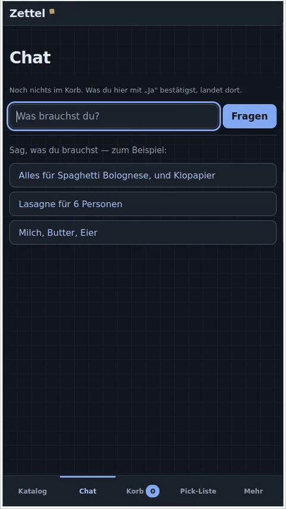

| | |
|---|---|
| 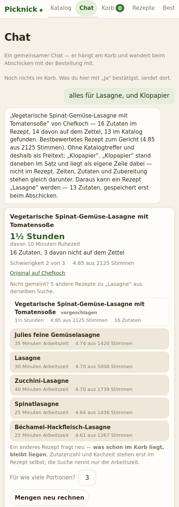 | 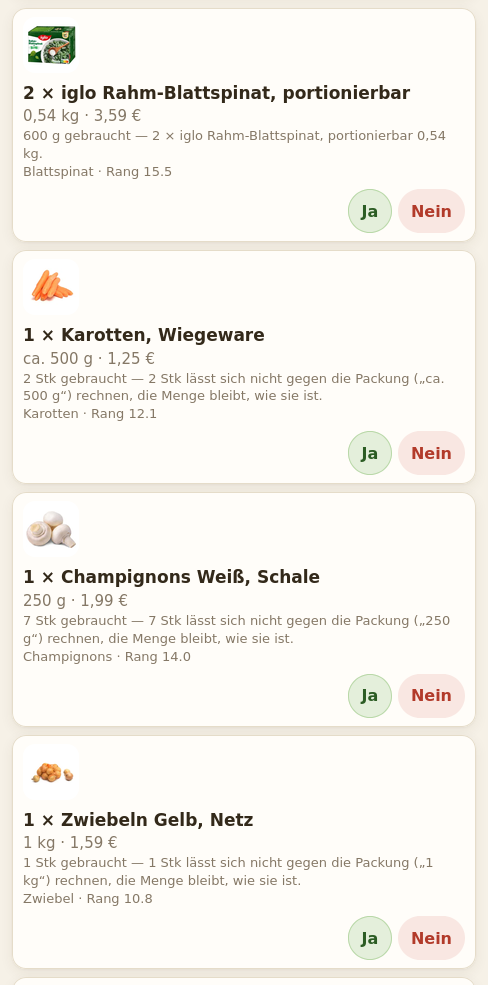 |

The user types *"alles für Lasagne, und Klopapier"* ("everything for lasagna,
and toilet paper"). The shop notices the dish, fetches the top-rated recipe
from Chefkoch's public JSON API (measured 90–147 ms — 250× faster than letting the
model guess the ingredients, which takes ~35 s and gets Vietnamese soup
wrong), and answers with:

* **a recipe card** — cooking time, difficulty, rating, a servings field that
  rescales every quantity, and five alternative recipes from the same search
  (choosing one costs no new search),
* **one suggestion row per ingredient**, each with the product photo, the
  needed amount from the recipe (*"600 g gebraucht — 2 × 0,54 kg"* — the pack
  count is computed, not guessed), the search term it came from, and its
  retrieval rank,
* **what the catalog cannot find stays visible as free text** — here
  *"süße Sahne"* (sweet cream: the recipe wants it, no product carries the
  words), shown with a dashed placeholder instead of silently disappearing.
  A dropped ingredient is only discovered in the store; a free text line is
  discovered now.
* **"Klopapier" finds "Toilettenpapier"** — not through the model. A
  five-entry table of everyday words the catalog spells differently
  (`ALLTAGSWORT` in `catalog/search.py`) is consulted in code, and the row
  names which word found the product. The admission rule is strict and
  tested against the real catalog: a pair goes in only if the everyday word
  has zero hits and the shop's word has some; "Zahnpasta" finds things on
  its own and is therefore *not* in the table. The rest of the sentence
  ("…und Klopapier") is appended in code, never left to the prompt (measured:
  0 of 35 turns carried it through when asked politely).

Nothing lands in the cart yet. Every row is confirmed with a per-row
**Yes/No** — and that decision doubles as the eval label later.

| | |
|---|---|
| 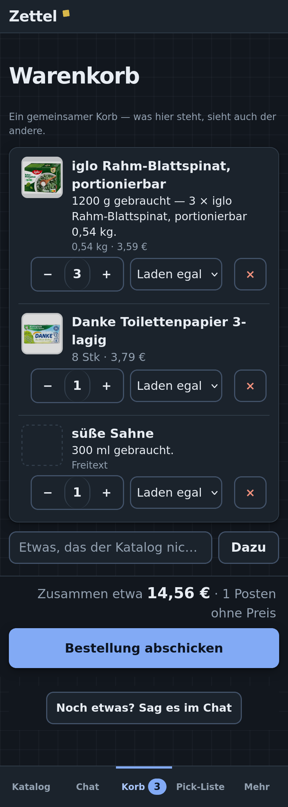 | 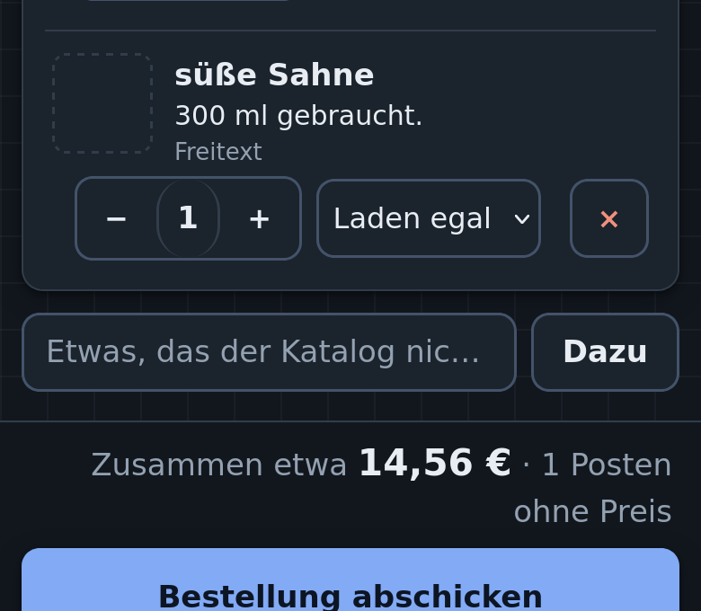 |
| 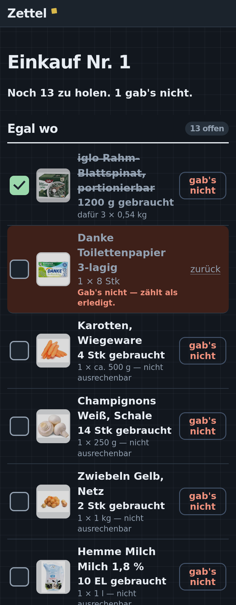 | 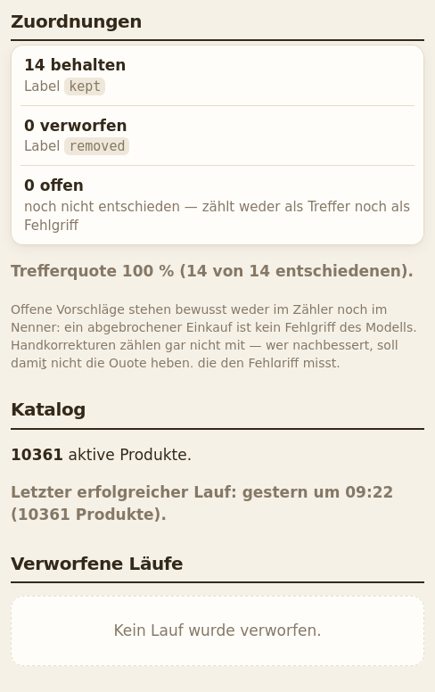 |

After "Yes": the cart shows the computed pack counts, the free-text line
("süße Sahne", no price, no photo) is still there, submitting turns the cart into the **pick list** he
checks off in the store ("gab's nicht" = the shelf was empty — an honest third
state), and the status page counts the labels every decision produced.

| | |
|---|---|
| 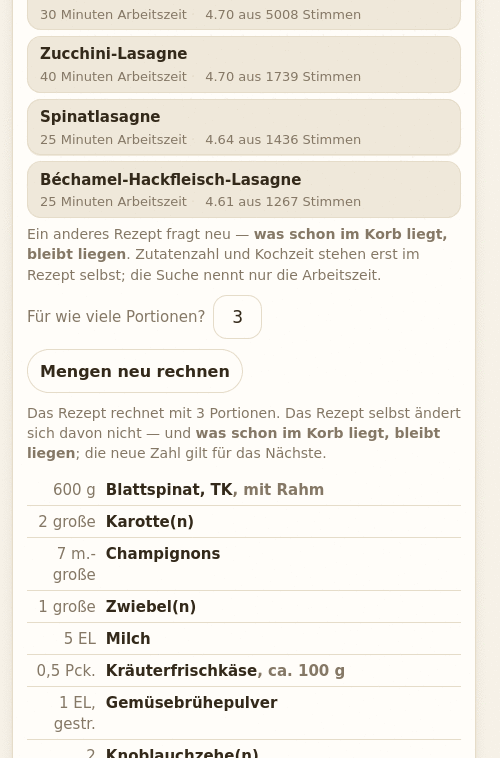 | 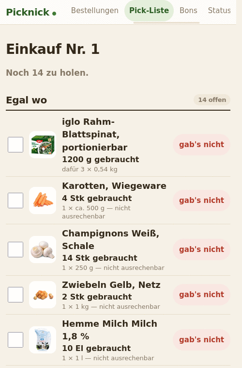 |

Left: the servings field on the recipe card — 3 → 6, and every quantity in
the ingredient list is recomputed (600 g spinach becomes 1200 g), while
anything already confirmed into the cart deliberately stays untouched.
Right: the pick list in the store — two items checked off, one marked
*"gab's nicht"*, which counts as done without pretending it was bought.
Confirmed ingredients become a **saved recipe** on submit — the next
"lasagna" answers from it with **zero model calls**.

## The stack, and why

| Piece | Why this one |
|---|---|
| **Qwen3.8-27B-Instruct** (dense, open weights) — the reference model | AWQ 4-bit (W4A16, repo `philbert440/Qwen3.8-27B-W4A16-AWQ`, quantized by philbert440, not by me), KV cache FP8 (fp8_e4m3) — **~17.4 GiB VRAM on a single NVIDIA RTX 3090 (24 GB)**. A consumer GPU, not a datacenter. |
| **NVIDIA Nemotron 3.5 Lightning 30B-A3B** (hybrid MoE, 3B active, open weights) — the model in the demo video | W4A16 via compressed-tensors, repo `useful-quants/NVIDIA-Nemotron-3.5-Lightning-30B-A3B-W4A16` (quantized by useful-quants, not by me), 16.6 GiB, validated by them on exactly this GPU. Nothing in the code is model-specific — the shop speaks the OpenAI wire format and asks `/v1/models` which model answers. |
| **vLLM 0.27.1** | Self-hosted on the LAN, systemd unit, `--max-num-seqs 32`, DFlash speculative decoding since 2026-09-01. Context length 65,536 tokens — the box reports it on `/v1/models`, and the docs quote what it reports. |
| **FastAPI + Jinja2 + HTMX** | One process, server-rendered, no build step. HTMX is a vendored file, not a CDN — the tailnet is not necessarily online. Every form also works without JavaScript. |
| **SQLite + FTS5** | Catalog (10,361 products), orders, chat, recipes, eval labels — one file, WAL mode, idempotent SQL migrations, no ORM. |
| **Arize Phoenix** (self-hosted) | Traces via OpenTelemetry/OpenInference, datasets, experiments, and annotations that flow back from real user decisions. |
| **No cloud, no API key** | The only external calls are a nightly catalog crawl and a twice-per-dish recipe fetch. If the internet is down, shopping still works. |

Measured throughput on this box (single RTX 3090, re-measured 2026-09-04 on vLLM 0.27.1 with speculative decoding — the earlier 24.9 / 74.8 tok/s were vLLM 0.24 without it):

| Metric | Value | Conditions |
|---|---|---|
| Single-stream, end-to-end | **70.0 tok/s** | 5.1k-token prompt, 450-token completion, thinking disabled, temperature 0 |
| Aggregate, 4 concurrent requests | **306 tok/s** | same workload, 76–80 tok/s per stream |

## The guarantees that make it interesting

**The model chooses only from what it was shown.** (The pattern, extracted
with its three code locations: [`PATTERN.md`](PATTERN.md).) The agent has
three stages, and the middle one is not a model call:

1. `plan.extract` — the model turns the sentence into *search terms with
   quantities*. It sees zero catalog entries.
2. `catalog.search` — **the shop** searches (FTS5), merges hits, and presents
   candidates. This is a `RETRIEVER` span, on purpose (see below).
3. `plan.choose` — the model picks **from that list**. An ID that was never
   presented is **rejected, not repaired**, and counted in
   `zettel.rejected` — visible in the trace *and* in the UI.

The same rule guards four different surfaces: product IDs, category names
(a typed "Aufschnitt" fans out into the catalog's own categories, and the
model may only map to one that was offered), recipe choices (only the twelve
recipes the search returned can be picked), and the term→ingredient mapping.
Structured output (`response_format: json_schema`) is on, but it enforces
the *shape*, not the truth — a well-formed integer can still be a
hallucinated one, so the check against the presented candidates lives in
code. That placement paid for itself on 2026-09-05: the box had moved to
vLLM 0.27.1 four days earlier, where the older `guided_json` extra-body field
is silently ignored (HTTP 200, prose instead of JSON, no warning). Stages 1
and 3 ran unconstrained for four days and every number stayed the same —
measured, not assumed: the 0.27.1 run of 2026-09-01 scores 84 % / 88 %, like
the constrained one. The agent now sends the standard `response_format`.

**Four "obviously LLM" tasks turned out not to need an LLM.** Retrieval is
FTS5, not the model. Fanning "Aufschnitt" out into its sorts is a `GROUP BY`
over the category tree (the model's own attempt produced "SCHWEINEBRUST" with
zero hits and a mangled "Birn"). Mapping each search term back to its recipe
ingredient — and thus its quantity — is a word comparison, because the term
was *made from* the ingredient name (37 of 38 correct on real data, zero
wrong). And "…and toilet paper" is appended in code, after measuring that the
model carried it through in **0 of 35** turns when asked politely in the
prompt. Each of these is a model call that can no longer hallucinate.

**Nothing lands in the cart unasked, and no decision is final.** Every
suggestion is confirmed per row; "Yes" can be withdrawn (back to *open*, not
flipped — a mis-tap on a phone must not fake an eval label), "No" unfolds the
alternatives *from the same search* instead of searching again, and a
correction row records what it corrected — which is exactly what turns it
into a `correction` annotation later.

## Observability that answered a real question

The model once picked an artisanal **"ButterBoyz BIO Salzbutter" for 4.69 €**
when asked for plain butter. Bad model? The trace says no:

```
"Butter" — 5 candidates presented        zettel.rejected = 0
   4.01  #1771  ButterBoyz BIO Butter Chili & Röstzwiebel
   4.01  #1772  ButterBoyz BIO Butter Feige & Anis
   3.96  #1757  ButterBoyz BIO Kräuterbutter
   3.96  #1766  ButterBoyz BIO Salzbutter      ← chosen
   3.96  #1768  ButterBoyz BIO Steinpilzbutter
"Zahnpasta" — 0 candidates presented
```

`rejected = 0`: the model invented nothing — **there was no normal butter in
the list**. The failure belongs to retrieval, not the model. That is why
`catalog.search` is a `RETRIEVER` span and not a `TOOL`: Phoenix renders the
candidates as scored documents, and the guilt question answers itself without
opening a JSON blob. The reading rule is documented and short:

| In the trace | Blame |
|---|---|
| the right product was not among the documents | retrieval |
| it was there, the model took another | model |
| `zettel.rejected > 0` | model, inventing |

Every chat turn is exactly one trace (`chat.turn` → `plan.extract`,
`catalog.search` ×N, `plan.choose`), the turn's span ID is stored with the
message, and when the order is submitted, the user's accumulated Yes/No/
correction decisions are written back to that span as annotations —
`kept`, `removed`, `correction` (with what would have been right), and a
`mapping_precision` score. **The eval labels fall out of the product**,
because the user has to go through the list anyway.

## The numbers, honestly

**Breadth: 64 dishes across 12 axes** (doubled to 128 on 2026-09-05 — the table above) (baking, vegan, typo'd, ambiguous,
fantasy names, exotic international, …), each driven through the full path —
sentence → ingredients → search terms → products → cart → shopping list.
No run failed. Median 34 s per dish.

* **446 of 540 search terms (83 %) found a catalog product** — median 89 %
  per dish, range 0–100. Two thirds of dishes land above 80 %; exactly one
  lands at zero (a deliberately fictional dish, "Schrumpelfrikandel").
  This number was 76 % until one measured line changed it: a frozen-prompt
  probe isolated the cause to the mere **presence** of the user's sentence
  in stage 3's prompt — Kartoffelpürree scored 0 of 10 with the sentence
  and 10 of 10 without, same candidates, reproduced three times, and
  Königsberger Klopse failed identically even though its sentence matched
  its recipe perfectly. One line stopped passing the sentence on the recipe
  path, and the re-run over the same 64 dishes moved 76 % → 83 % and
  dishes-at-zero 4 → 1 — the full story, tables included, is in
  [`CASE-STUDY.md`](CASE-STUDY.md).

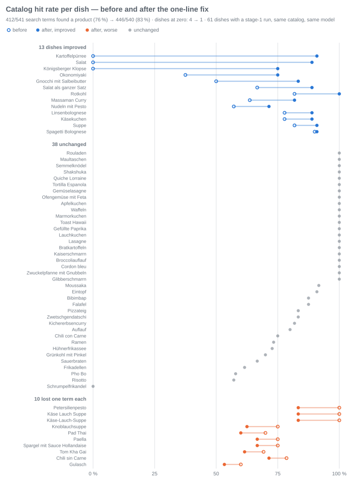

**Two more open models through the same harness.** Because the dishes,
the database-copy discipline and the per-turn attributes are fixed, judging
another model costs an afternoon and no production code. NVIDIA's
`Llama-3.1-Nemotron-Nano-8B` (BF16) went through on 2026-08-30, the current
**Nemotron 3.5 Lightning 30B-A3B** (W4A16, 16.6 GiB on the same RTX 3090)
on 2026-09-05 — same run, same conditions, traces in their own Phoenix
projects, numbers recomputed from the spans. First the 64-dish list, then
the list doubled to 128 the same day:

| per dish, 64 dishes | Qwen3.8-27B (AWQ 4-bit) | Nemotron-Nano-8B (BF16) | **Nemotron 3.5 Lightning (W4A16)** |
|---|---|---|---|
| catalog hit rate, mean / median | 84 % / 88 % | 25 % / 0 % | **85 % / 88 %** |
| dishes at 0 % | 1 | 41 | **0** |
| dishes at 80–100 % | 43 | 10 | 42 |
| extra article reaches the cart | 8 of 8 | — | 6 of 8 |
| structured output | fine | fine (`rejected` = 2) | fine (`rejected` = 2) |
| median turn (vLLM 0.27.1; Qwen with DFlash2 speculative decoding, Nemotron without) | 7 s | — | **6 s** |
| whole run, 64 dishes | 7.0 min (on vLLM 0.24) | — | **1.1 min** |

| per dish, **128 dishes** (2026-09-05) | Qwen3.8-27B (AWQ 4-bit) | Nemotron 3.5 Lightning (W4A16) |
|---|---|---|
| search terms that found a catalog product | **87 %** (962 of 1,107) | 85 % (997 of 1,167) |
| catalog hit rate per dish, mean / median | **89 % / 91 %** | 87 % / 89 % |
| dishes below 40 % | 0 | 1 (a fictional dish, 0 of 2 guessed terms) |
| dishes at 80–100 % | 104 | 93 |
| extra article reaches the cart | 13 of 16 | 13 of 16 |
| `rejected` total | 1 | 1 |
| median turn / whole run | 20 s / 7.4 min | **6 s / 2.2 min** |

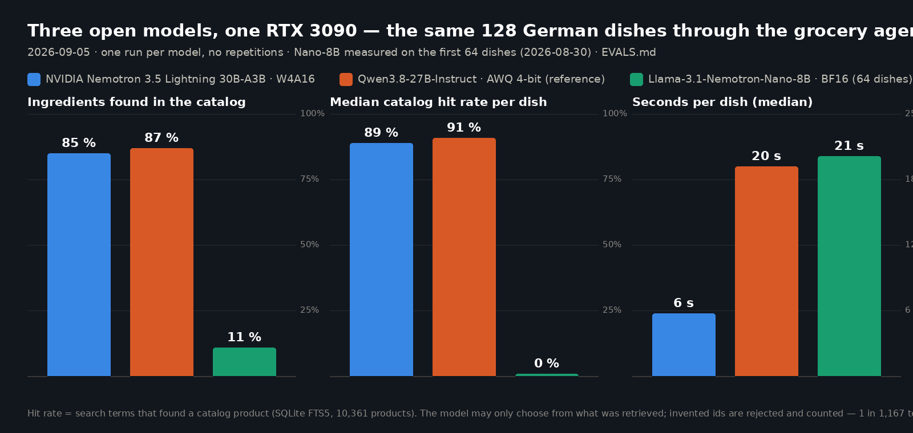

The 8B Nano is faster because it produces less that the catalog can find —
whole dishes come back empty (Ratatouille 0 of 13). The 3.5 Lightning is on
par with the 27B reference on 64 dishes and two points behind on 128
(a small, consistent gap in everyday and baking dishes; equal in the exotic
ones), at three times the speed and the same form discipline. Which one runs
the household is now a measured choice, not a brand preference — see
[`EVALS.md`](EVALS.md).

The quantity chain was audited link by link in [`EVALS.md`](EVALS.md):

* **Not one suggestion line was lost**: 481 rows → 481 cart items → 481
  shopping-list lines, and **92 % of all 524 list lines carry a quantity into
  the store** (re-measured 2026-08-30 over the same 64 dishes).
* The missing quantities split cleanly into measured links: the recipe itself
  has none ("salt, to taste" — 16 %), the word mapping misses the ingredient
  (22 %), and the unit is not computable against the pack ("2 onions" vs. a
  1 kg net, 95× — the quantity still shows, only the pack count stays at 1).
  A fourth link used to lose 115 lines outright (free-text items dropped their
  quantity when added to the cart); it was fixed, guarded by tests, and the
  re-run confirms it in the breadth: 71 % → 92 %.
* The extra article ("…and toilet paper") arrived in the cart **8 of 8**
  times, once translated by the model.

**Depth: 12 fixed queries, 3 evaluators, 4 agent variants** as Phoenix
experiments — one knob changed per variant. The interesting result is what
did *not* move: 20 candidates instead of 5 changed nothing, and turning
`guided_json` **off** moved none of the three scores — the twelve outputs
came back word-identical, schema or no schema (at temperature 0 the
constraint never binds; it is insurance against a different model, not an
improvement of this one). A completeness-first
prompt variant raised ingredient recall 0.611 → 0.750 for the measured
reason (it stopped forgetting onions and garlic), and precision 0.850 →
0.960 — partly by **omitting** an item, which the docs flag as suspect
rather than celebrate.

**Gates: 1,364 tests and a 79-check smoke gate** (counted 2026-09-05 — the
numbers keep growing), both running without
network, model, or Phoenix — and for the gate that is *enforced, not
assumed*: it monkeypatches `socket.connect/bind/getaddrinfo` before the
first project import and proves the block works by failing a connection to
the very Phoenix port that is live on the dev machine.

## What is weaker than it looks

A showcase that hides its edges is an ad. The measured ones:

* **The 83 % has a price, and one path is unmeasured.** The one-line fix
  that rescued the zero-scoring dishes ("Salat": 0 of 9 → 8 of 9) removed
  the sentence from stage 3 on the recipe path — 13 dishes improved, but 10
  lost exactly one term each (visible in the chart above). And whether the
  *model* path actually needs the sentence ("Milch für den Kaffee") remains
  an assumption: every frozen fixture is a recipe-path turn, so the path
  that kept the sentence is the one that was never measured.
* **The search knows prefixes only** — "milch" never finds "Landmilch" by
  name, German compounds put the noun at the end — **but that is not where
  the eval loses its terms.** Measured 2026-09-04 without a model, on the
  264 distinct first search terms of the 64-dish run: 91 find nothing by
  prefix, and a substring fallback would rescue exactly **one** of them
  ("Fleischbrühe" → "Rindfleischbrühe"). The other 90 are vocabulary the
  catalog does not carry under that name ("Knoblauchzehe", "festkochende
  Kartoffeln", "Staudensellerie") — which the term chain already handles by
  falling back to the plain noun. So the substring index stays unbuilt, on
  purpose, and the five-word everyday table ("Klopapier" → "Toilettenpapier")
  remains the only patch: measured before built, and the measurement said no.
* **"2 onions" vs. "1 kg net"**: 328 of 485 quantities reach the list but
  cannot be computed against the pack unit (95× piece-vs-weight, then
  tablespoons). The list shows the need; the pack count stays an honest 1.
* **One run, no repetitions** — for both measurements. Bibimbap scored 0,
  then 7 of 8 when re-run. The eval deltas (0.850 vs. 0.960) sit on two
  examples out of ten. There are no confidence intervals because there is
  nothing to compute them from.
* **The LLM judge is the same Qwen that runs the agent** — same blind spots.
  It therefore only judges where the deterministic scores cannot, and its
  column sits beside them, never above.
* **The UI has never been checked on a physical phone.** Designed for
  390 px, verified over HTTP tests and headless screenshots — whether
  nothing scrolls sideways on real glass, nobody has confirmed with eyes.

## Run it

```bash
python3 -m venv .venv && .venv/bin/pip install -r requirements.txt
.venv/bin/python -m pytest -q          # the full suite, no network needed
.venv/bin/python checks/smoke.py       # the gate, network actively blocked
.venv/bin/python -m zettel.web.app   # binds loopback + tailnet only — 0.0.0.0 is refused
```

The chat needs a local vLLM endpoint (`ZETTEL_LLM_ENDPOINT`); everything
else — catalog, cart, pick list, saved recipes — runs without it, by design.
Every variable, the first turn and the eval harness are in
[`GETTING-STARTED.md`](GETTING-STARTED.md); the household manual (German)
is [`ANLEITUNG.md`](ANLEITUNG.md).
There is no password: the shop refuses to bind anything but loopback and a
tailnet address, with a whitelist, before a socket exists.

*Contest material: the 60-second video script lives in
[`docs/contest/VIDEO.md`](docs/contest/VIDEO.md), the post draft in
[`docs/contest/POST.md`](docs/contest/POST.md).*
